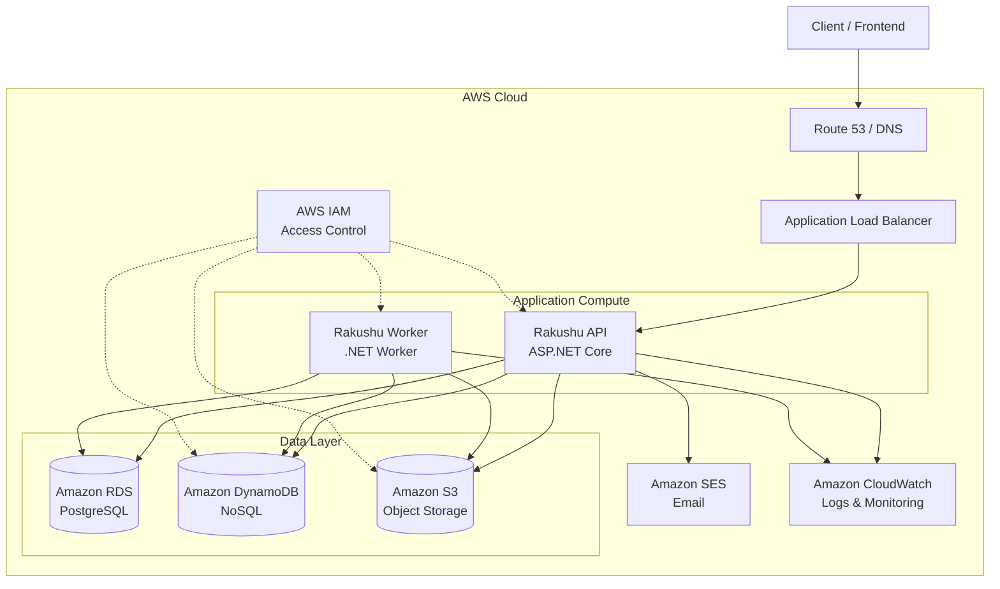
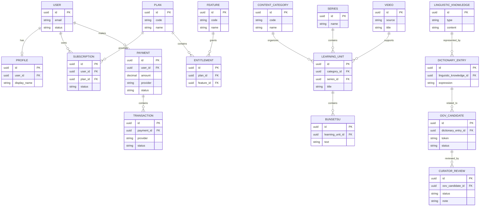

# Rakushu API

> **Short name:** Rakushu API  
> **Full name:** Rakushu — Japanese Learning & Linguistic Knowledge Platform API

Rakushu API is the backend platform for a Japanese-learning ecosystem that combines structured learning content, linguistic knowledge, learner management, subscriptions, and AI-assisted language workflows. The service is designed around **Domain-Driven Design (DDD)** and **Clean Architecture**, with a modular ASP.NET Core backend and a cloud-oriented infrastructure.

The API is intentionally separated from operational documentation. **Installation, local setup, environment variables, deployment commands, and user manuals are maintained separately.**

---

## 1. Project Overview

### 1.1 Project Name

| Item | Description |
| --- | --- |
| **Short name** | **Rakushu API** |
| **Full name** | **Rakushu — Japanese Learning & Linguistic Knowledge Platform API** |
| **Primary platform** | Japanese learning and linguistic knowledge |
| **Backend** | ASP.NET Core 8 / C# |
| **Architecture** | DDD + Clean Architecture |
| **Primary database** | PostgreSQL |
| **Cloud ecosystem** | AWS |

### 1.2 Short Description

Rakushu provides the backend foundation for a Japanese-learning platform where learning content, linguistic resources, learner profiles, subscriptions, payments, and curator-managed linguistic knowledge are modeled as business domains rather than as a collection of CRUD-only endpoints.

The backend exposes HTTP APIs through ASP.NET Core Minimal APIs, coordinates application use cases through MediatR, protects domain invariants inside aggregates, and isolates persistence/infrastructure concerns from the core business model.

---

### 1.3 Core Solutions

The current platform is organized around three major solution areas.

#### Core Feature 01 — Learning & Linguistic Knowledge

Rakushu models Japanese learning materials and linguistic knowledge as first-class domain concepts.

Key capabilities include:

- Learning units and learning content
- Content categories and series
- Bunsetsu-based learning structures
- Linguistic knowledge and metadata
- Dictionary entries and language-related knowledge
- Structured relationships between learning content and linguistic resources
- Administrative CRUD workflows for core learning resources

The goal is to move beyond simple content storage and provide a domain model that can support language-aware learning experiences.

#### Core Feature 02 — Curator & OOV Knowledge Lifecycle

Rakushu includes a curator workflow for handling **Out-of-Vocabulary (OOV)** candidates and linguistic knowledge.

The lifecycle includes:

- OOV candidate ingestion
- Candidate inspection
- Manual candidate creation
- Curator review
- Candidate acceptance/rejection workflows
- Dictionary / linguistic knowledge synchronization
- Domain validation around knowledge state transitions

This creates a feedback loop between AI/NLP processing and human-curated linguistic knowledge.

#### Core Feature 03 — Subscription, Entitlement & Payment

Rakushu provides a business model for monetizing learning capabilities.

The domain includes:

- Plans
- Features
- Entitlements
- User subscriptions
- Payment records
- Transactions
- Payment gateway abstraction
- VNPAY integration
- SEPAY provider support at the domain/application level
- Payment notification / IPN handling

The entitlement model allows platform capabilities to be associated with subscription plans instead of hard-coding feature access inside individual endpoints.

---

### 1.4 Applied Methods & Technologies

Rakushu combines conventional backend engineering with language-learning and AI-oriented methods.

| Method / Technology | Application |
| --- | --- |
| **NLP** | Japanese linguistic processing, linguistic metadata, dictionary knowledge and OOV workflows |
| **LLM** | AI-assisted language understanding and knowledge generation workflows |
| **OOV Detection** | Identifying language items that are not sufficiently covered by existing knowledge |
| **Curator-in-the-loop** | Human validation of AI/NLP-generated linguistic candidates |
| **SRS** | Spaced-repetition-oriented learning workflows and quiz capabilities |
| **DDD** | Business domains, aggregates, entities, value objects and domain invariants |
| **Clean Architecture** | Separation of domain, application, infrastructure, persistence and API concerns |
| **CQRS-style use cases** | Commands and queries represented as separate application requests |
| **Result / ROP** | Explicit success/failure propagation without relying exclusively on exceptions |
| **Specification** | Reusable domain/business predicates |
| **Factory Method** | Controlled creation of domain objects and infrastructure services |

---

# 2. Implementation

## 2.1 Domain Modeling — DDD

Rakushu applies **Domain-Driven Design** to keep business rules inside the domain instead of allowing controllers or persistence models to become the business model.

### Domain concepts applied

- **Entities** with identity and lifecycle
- **Aggregate Roots** as consistency boundaries
- **Value Objects** for domain-specific identifiers and concepts
- **Domain Errors** for explicit business failures
- **Domain methods** for state transitions
- **Factory methods** for controlled object creation
- **Specifications** for reusable business predicates
- **Domain-oriented repositories**
- **Domain events / event handlers** where cross-domain reactions are required

The current domain is divided into business-oriented areas such as:

- User & Profile
- Learning
- Content Category
- Linguistic Knowledge
- Dictionary
- OOV Candidate
- Curator Review
- Subscription
- Plan & Feature
- Payment
- Video / learning content

### DDD principle

The API should not decide *how a domain object is allowed to change*. The domain model should own that responsibility.

Conceptually:

```
HTTP Request
     |
     v
Application Use Case
     |
     v
Domain Aggregate
     |
     +----> Validate invariant
     |
     +----> Execute domain behavior
     |
     v
Repository / Unit of Work
```

This keeps business rules independent from ASP.NET Core, EF Core, PostgreSQL, AWS, or external payment providers.

---

## 2.2 Software Architecture — Clean Architecture

Rakushu follows a layered architecture where dependencies point toward the business core.

```text
                         +----------------------+
                         |      Rakushu.Api     |
                         | Minimal API / HTTP    |
                         +----------+-----------+
                                    |
                                    v
                         +----------------------+
                         | Rakushu.Application  |
                         | Use Cases / CQRS      |
                         | Validation / Behaviors|
                         +----------+-----------+
                                    |
                                    v
                         +----------------------+
                         |    Rakushu.Domain    |
                         | Entities / Aggregates|
                         | Value Objects / Rules|
                         +----------------------+
                                    ^
                                    |
              +---------------------+---------------------+
              |                                           |
+-------------+--------------+              +-------------+--------------+
| Rakushu.Persistence        |              | Rakushu.Infrastructure     |
| PostgreSQL / EF Core       |              | AWS / Email / Payment /   |
| Dapper / Repositories      |              | Storage / External APIs    |
+----------------------------+              +----------------------------+
```

### Layer responsibilities

#### API Layer — `Rakushu.Api`

Responsible for:

- HTTP endpoints
- Request/response contracts
- Authentication and authorization wiring
- API versioning
- Swagger / OpenAPI
- Middleware
- HTTP error mapping
- Mapping application results to HTTP responses

The API layer does not own domain business rules.

#### Application Layer — `Rakushu.Application`

Responsible for:

- Application use cases
- Commands and queries
- MediatR handlers
- DTOs
- Application validation
- Pipeline behaviors
- Application abstractions
- Coordination of domain operations

The application layer orchestrates business workflows without depending on concrete infrastructure implementations.

#### Domain Layer — `Rakushu.Domain`

Responsible for:

- Entities
- Aggregate Roots
- Value Objects
- Domain rules
- Domain errors
- Specifications
- Domain behavior
- Domain abstractions

This is the architectural core.

#### Persistence Layer — `Rakushu.Persistence`

Responsible for:

- PostgreSQL access
- Entity Framework Core
- Dapper queries
- DbContext
- Repository implementations
- Database configurations
- Migrations
- Seed/data scripts

#### Infrastructure Layer — `Rakushu.Infrastructure`

Responsible for external technical concerns:

- AWS S3 storage
- AWS SES email
- JWT authentication infrastructure
- Payment gateways
- VNPAY integration
- External service adapters
- Infrastructure-specific configuration

#### Worker Layer — `Rakushu.Worker`

Responsible for background processing that should not block an HTTP request.

The worker is deployed as a separate .NET Worker process and reuses the Application/Infrastructure layers where appropriate.

---

## 2.3 Design Patterns

### Factory Method Pattern

Factory methods are used to control domain object creation and keep construction rules close to the model.

Instead of allowing callers to freely construct an entity:

```text
Caller
  |
  v
Domain Factory Method
  |
  +--> Validate input
  +--> Establish initial state
  +--> Enforce invariants
  |
  v
Valid Domain Object
```

Factory abstractions are also used for infrastructure concerns such as payment gateway selection.

Example concept:

```text
PaymentGatewayFactory
        |
        +---- VNPAY
        |
        +---- SEPAY
        |
        +---- Other providers
```

### Specification Pattern

Specifications encapsulate reusable business predicates.

Examples include specifications for active domain objects such as:

- Active User
- Active Content Category
- Active Proficiency Level

This avoids scattering repeated business predicates throughout handlers and repositories.

### Result Pattern

Application use cases return explicit `Result` / `Result<T>` values.

```text
Result<T>
  |
  +---- Success(T)
  |
  +---- Failure(Error)
```

This makes expected business failures explicit and keeps the application flow predictable.

### Railway-Oriented Programming (ROP)

The Result model supports a lightweight ROP style:

```text
Request
  |
  v
Validate
  |
  +---- Failure ----> Error Response
  |
  v
Execute Use Case
  |
  +---- Failure ----> Error Response
  |
  v
Persist
  |
  +---- Failure ----> Error Response
  |
  v
Success
```

At the API boundary, Result values are converted into appropriate HTTP responses such as:

- `200 OK`
- `201 Created`
- `202 Accepted`
- `204 No Content`
- `400 Bad Request`
- `404 Not Found`
- `409 Conflict`
- `500 Internal Server Error`

### Additional patterns

The implementation also uses:

- **CQRS-style Command / Query separation**
- **Repository Pattern**
- **Unit of Work**
- **Dependency Injection**
- **Pipeline Behavior**
- **Adapter Pattern**
- **Strategy-style provider selection**
- **Domain Event Handling**

---

# 3. Technical

## 3.1 API — ASP.NET Core

Rakushu is implemented using **ASP.NET Core 8** with a Minimal API approach.

### Minimal API

Endpoints are organized by business capability rather than by a large controller hierarchy.

Conceptually:

```text
/api
├── authentication
├── user
├── learning
├── linguistic
├── curator
├── subscription
├── payment
└── storage
```

Each endpoint delegates business work to an application use case instead of implementing domain logic directly.

### Application flow

```text
HTTP
 |
 v
Minimal API Endpoint
 |
 v
MediatR Request
 |
 v
Validation Pipeline
 |
 v
Application Handler
 |
 v
Domain
 |
 v
Persistence / Infrastructure
 |
 v
Result<T>
 |
 v
HTTP Response
```

### API capabilities

- ASP.NET Core 8
- Minimal APIs
- API Versioning
- Swagger / OpenAPI
- JWT Bearer Authentication
- Authorization
- CORS
- Global exception handling
- Problem Details
- FluentValidation
- MediatR
- Docker-ready Linux containers

### Background processing

The solution contains a dedicated `Rakushu.Worker` project based on .NET Worker Services.

The separation allows long-running or asynchronous workloads to execute independently from the request/response API process.

---

## 3.2 Database

### PostgreSQL — SQL

PostgreSQL is the primary relational database for transactional business data.

It is used with:

- Entity Framework Core
- Npgsql
- Dapper
- Repository abstractions
- Database migrations
- Explicit persistence configurations
- SQL seed/data scripts

Relational modeling is used for strongly connected business concepts such as:

```text
User
 |
 +---- Profile
 |
 +---- Subscription
 |       |
 |       +---- Plan
 |       +---- Entitlement
 |
 +---- Payment
         |
         +---- Transaction
```

### AWS DynamoDB — NoSQL

DynamoDB is part of the target non-relational data architecture for workloads where flexible schema, high-throughput access patterns, or AI/learning-oriented state can benefit from a key-value/document model.

Typical candidates include:

- AI/LLM processing state
- High-volume learner activity
- Flexible linguistic/AI metadata
- Denormalized read models
- Event-oriented or session-oriented data

> **Implementation note:** the current `main` source tree visibly wires PostgreSQL, AWS S3 and AWS SES. DynamoDB is documented here as the non-relational component of the AWS data architecture and should be treated as an integration boundary rather than assumed to be active in every current deployment.

### Polyglot persistence

The overall data strategy is:

```text
                 Rakushu Application
                         |
              +----------+----------+
              |                     |
              v                     v
       PostgreSQL / SQL       DynamoDB / NoSQL
       Transactional data     Flexible / high-scale
              |                     |
              +----------+----------+
                         |
                    Domain Model
```

The choice of storage is driven by workload and access patterns rather than forcing every domain concept into one database technology.

---

# 4. Hosting & Infrastructure — AWS Cloud

Rakushu is designed for AWS-based deployment and uses AWS services for external infrastructure capabilities.

## 4.1 AWS Services

| Service | Responsibility |
| --- | --- |
| **Amazon EC2 / ECS-style compute** | Host containerized API and Worker workloads |
| **Amazon RDS for PostgreSQL** | Managed relational database |
| **Amazon DynamoDB** | Non-relational / high-throughput data |
| **Amazon S3** | Object/file storage |
| **Amazon SES** | Transactional email |
| **AWS IAM** | Identity and least-privilege access between services |
| **Amazon CloudWatch** | Logs, monitoring and operational observability |
| **Application Load Balancer** | HTTP/HTTPS traffic distribution |
| **Amazon VPC** | Network isolation and private infrastructure |
| **Security Groups** | Network-level access control |

The application already contains AWS SDK integration for **S3** and **SES**, while the broader cloud architecture separates compute, transactional persistence, object storage, messaging/email, and operational concerns.

## 4.2 Infrastructure Diagram



### Infrastructure principles

- Container-friendly deployment
- Stateless API instances where possible
- Background workloads isolated into a Worker process
- Managed database services
- Object storage separated from transactional storage
- IAM-based service permissions
- Centralized logging and monitoring
- Horizontal scalability at the API layer

---

# 6. Logical ERD

The following diagram presents the major business relationships rather than every physical database column.



The physical schema may contain additional supporting entities, metadata, role/permission models, linguistic structures, audit fields, and infrastructure-specific tables.

---

# 7. Conclusion

Rakushu API is designed as a **domain-oriented Japanese learning backend**, rather than a conventional CRUD service.

Its architecture combines:

- **DDD** for modeling complex learning and linguistic business rules
- **Clean Architecture** for dependency isolation
- **Minimal APIs** for lightweight HTTP delivery
- **MediatR + CQRS-style use cases** for application orchestration
- **Result / ROP** for explicit failure handling
- **Specification and Factory patterns** for reusable domain and infrastructure behavior
- **PostgreSQL + DynamoDB** for polyglot persistence
- **AWS services** for cloud storage, email, compute, security and observability
- **NLP / LLM / OOV / Curator workflows** for AI-assisted linguistic knowledge
- **SRS-oriented learning capabilities** for repeated learning and quiz workflows

The result is a backend foundation that can evolve independently across learning, linguistic intelligence, AI processing, subscriptions, payments, and infrastructure without coupling business rules to a specific framework or storage technology.

---

# 8. Contributor

| Contributor | Responsibility |
| --- | --- |
| **Trần Hoàng Hòa** | Backend architecture, domain/application implementation, business features and infrastructure |
| **Trần Hoàng Huy** | Backend architecture, domain modeling, API implementation, AI/NLP-oriented integration and system refactoring |

---

## Architecture at a Glance

```text
                         RAKUSHU
                            |
          +-----------------+-----------------+
          |                 |                 |
       Learning          Linguistic       Monetization
          |                 |                 |
     Content/SRS       NLP/LLM/OOV       Plan/Payment
          |                 |                 |
          +-----------------+-----------------+
                            |
                    Application Use Cases
                            |
                       Domain Model
                            |
          +-----------------+-----------------+
          |                                   |
      PostgreSQL                         AWS Services
          |                                   |
      Transactional               S3 / SES / DynamoDB
          |                                   |
          +-----------------+-----------------+
                            |
                     ASP.NET Core API
                            +
                     .NET Background Worker
```
